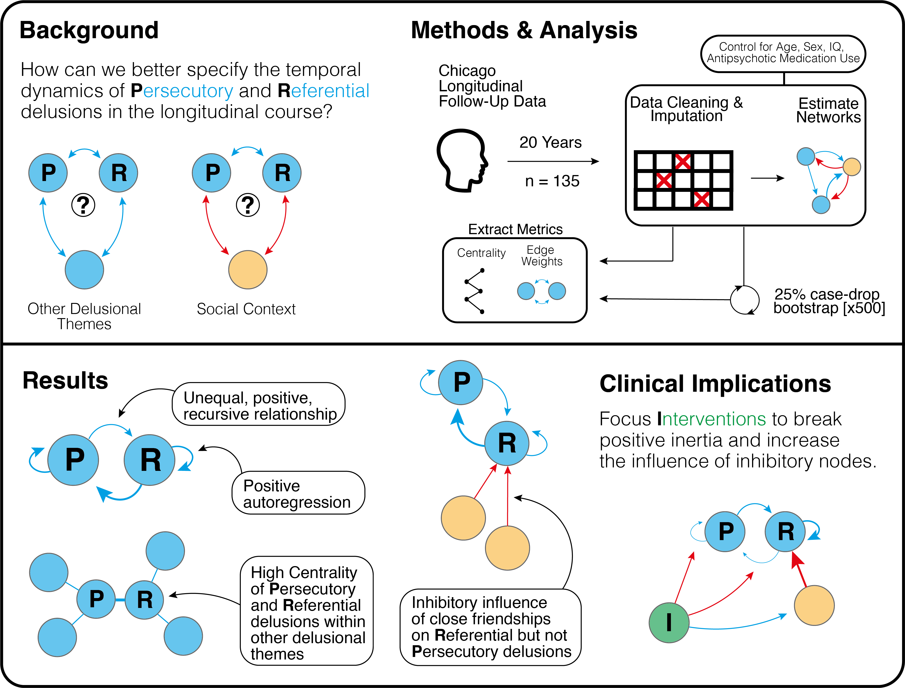

# ParanoiaLongitudinalNetworkAnalysis
Data and analysis for "Modelling the Longitudinal Dynamics of Paranoia in Psychosis: A Temporal Network Analysis Over 20 Years" - Barnby, J.M., Haslbeck, J.M.B., Rosen, C., Harrow, M.

